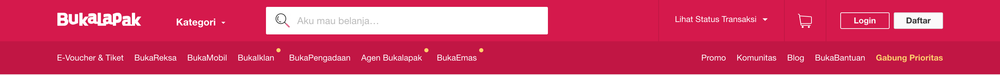
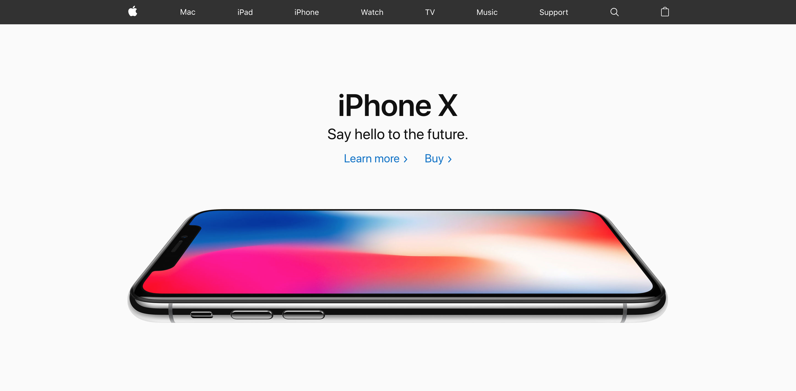
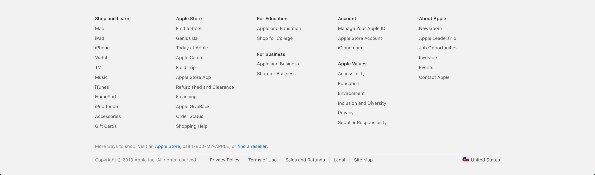

# Komponen Website

## Kategori Pembuat Website

Dalam komponen pembuatan *website*, **kita bisa membagi kategori orang yang mengerjakan *website* tersebut ke dalam dua jenis**.

Anggap saja kita **sedang membuat suatu acara**. Untuk memastikan acara tersebut berjalan lancar dibutuhkan tim yang baik.

- Pertama, kita membutuhkan seorang ***front-end engineer*** yaitu orang yang bertugas **mengurusi semua kebutuhan di depan layar**.

- Ke dua, kita membutuhkan ***back-end engineer*** yaitu orang yang bertugas **mengurusi semua kebutuhan di belakang layar**.

Apapun jenis *website* yang mau dibuat, sebaiknya kita memperhatikan kualitas UI *(user interface)* dari *website* tersebut.

**Kita bisa mulai dengan membuat *bluprint* UI-nya terlebih dahulu.** Untuk pembuatan *blueprint* UI, biasanya dikerjakan oleh bagian *front-end engineer* yang khusus membuat desain *website* itu berdasarkan kebutuan user. **Orang yang membuat *blueprint* UI tersebut, dinamakan *UI Designer*** dan *UI Designer* merupakan bagian dari *front-end engineer*. **Kualitas *blueprint* UI yang bagus nantinya akan diterjemahkan ke dalam bentuk *website* atau *mobile* oleh *UI engineer* menggunakan html, css, javascript, dan komponen-komponen lainnya** yang dibutuhkan. *UI engineer* juga merupakan bagian dari *front-end engineer*.

## Beberapa Istilah dalam Dunia Website

1. *Header*

    Adalah **komponen yang terletak pada bagian paling atas**. Biasanya digunakan untuk meletakkan logo, menu navigasi dan *link* lainnya.

     Header bukalapak

     Header amazon

     Header zalora

2. *Hero*

    Biasanya **terletak di halaman depan, posisi di bagian atas (biasanya di bawah *header*), dan ditempatkan seperti itu untuk menarik perhatian pengunjung saat pertama kali mengunjungi sebuah *website*.**

    Karena menjadi bagian yang paling menarik perhatian pengunjung, bagian Hero ini digunakan untuk menempatkan informasi yang cukup penting biasanya.

    Beberapa hal yang biasanya ditaruh di bagian Hero:

    1. *Overview* tentang produk
    2. Produk terbaru
    3. Promo terbaru
    4. Form pendaftaran

     Apple.com menaruh produk terbaru di bagian hero

3. *Footer*

    **Terletak di bagian paling bawah**. Konten dari *footer* ini sangat bebas. **Kita bisa menaruh apapun yang kita mau di bagian footer**. Beberapa hal yang biasanya terdapat di *footer*:

    1. Sosial media
    2. *Form* pendaftaran
    3. *Email subscription*

     *Footer* dari Apple.com

Dan masih banyak lagi..
