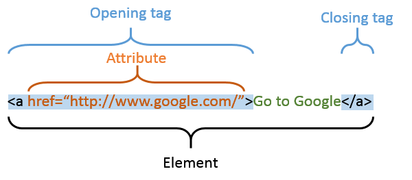

# Tag, Atribut, dan Element pada HTML

1. Tag

   **Tag dalam HTML berfungsi untuk menginformasikan *web browser* kita bagaimana teks harus ditampilkan**. Sebagian besar tag-tag HTML ditulis secara berpasangan, yang terdiri dari tag pembuka dan tag penutup. Tag pembuka ditulis menggunakan **kurung siku**, seperti `<html>` Sedangkan tag penutup ditulis dengan menambahkan tanda **garis miring atau slash** seperti `</html>`.

   Tag `<html>` berfungsi sebagai tag pembuka halaman HTML dan diakhiri dengan tag `</html>`.

   Tag lain yang sering digunakan adalah `<p>` untuk paragraf. Sebagai contoh, jika kita ingin membuat struktur teks yang terdiri dari 2 paragraf, maka kita menulisnya sebagai berikut:

   ```html
   <p>Kita membuat paragraf 1</p>
   <p>Kita membuat paragraf 2</p>
   ```

   Ketika *web browser* membaca kode di atas, teks diantara tag `<p>` dan tag `</p>` akan ditampilkan sebagai paragraf yang terpisah.

   Setiap tag memiliki fungsi dan peran masing-masing. Total, terdapat sekitar seratusan tag di dalam HTML. Walaupun HTML memiliki banyak tag, tidak semuanya harus digunakan.

   | No  | Nama Tag         | Fungsi                                                                                                                        |
   | --- | ---------------- | ----------------------------------------------------------------------------------------------------------------------------- |
   | 1   | `<!--...-->`     | Tag untuk membuat komen                                                                                                       |
   | 2   | `<!DOCTYPE>`     | Untuk menentukan tipe dokumen                                                                                                 |
   | 3   | `<a>`            | Tag untuk membuat tautan atau *link*                                                                                                 |
   | 4   | `<abbr>`         | Untuk membuat singkatan atau akronim                                                                                          |
   | 5   | `<address>`      | Untuk mendefinisikan kontak dari pembuat *author*                                                                               |
   | 6   | `<area>`         | Untuk mendefinisikan area didalam `image-map`                                                                                   |
   | 7   | `<article>`      | Untuk mendefinisikan artikel                                                                                                  |
   | 8   | `<aside>`        | Tag untuk mendefinisikan konten di luar konten utama                                                                           |
   | 9   | `<audio>`        | Untuk mendefinisikan konten berupa *audio*                                                                                      |
   | 10  | `<b>`            | Membuat teks tebal                                                                                                            |
   | 11  | `<base>`         | Mendefinisikan URL dasar atau URL target untuk semua URL yang berkaitan pada satu dokumen                                         |
   | 12  | `<bdi>`          | Tag untuk mengisolasi bagian teks yang mungkin diformat dalam arah yang berbeda dari teks lain di luarnya                     |
   | 13  | `<bdo>`          | Tag untuk mengganti arah teks yang ada                                                                                        |
   | 14  | `<blockquote>`   | Tag untuk membuat satu bagian yang berisi *quote* dari sumber lain                                                              |
   | 15  | `<body>`         | Mendefinisikan *body* dari HTML, kita menaruh semua konten kita di dalam tag ini                                                |
   | 16  | `<br>`           | Membuat *break* sebanyak satu baris                                                                                             |
   | 17  | `<button>`       | Tag untuk membuat tombol                                                                                                      |
   | 18  | `<canvas>`       | Digunakan untuk membuat menggambar grafik dengan *scripting*                                                                    |
   | 19  | `<caption>`      | Untuk mendefinisikan *caption* dari sebuah tabel                                                                                |
   | 20  | `<cite>`         | Untuk mendefinisikan judul dari sebuah hasil pekerjaan                                                                        |
   | 21  | `<code>`         | Tag untuk membuat satu bagian yang berisi kode                                                                                |
   | 22  | `<col>`          | Mendefinisikan properti kolom untuk tiap kolom dalam elemen `<colgroup>`                                                      |
   | 23  | `<colgroup>`     | Mendefinisikan sebuah *grup* dari satu atau lebih kolom dalam *formating* tabel                                                   |
   | 24  | `<dialog>`       | Membuat kota dialog atau *window*                                                                                               |
   | 25  | `<div>`          | Tag untuk membuat *section* bagian di dalam dokumen HTML                                                                        |
   | 26  | `<dt>`           | Tag untuk mendefinisikan istilah atau nama dalam daftar deskripsi                                                                |
   | 27  | `<em>`           | Tag untuk menentukan teks yang ditekankan                                                                                     |
   | 28  | `<embed>`        | Tag untuk mendefinisikan sebuah wadah untuk aplikasi eksternal (non-HTML)                                                     |
   | 29  | `<fieldset>`     | Grup elemen terkait dalam suatu formulir                                                                                      |
   | 30  | `<figcaption>`   | Mendefinisikan keterangan untuk elemen `<figure>`                                                                             |
   | 31  | `<figure>`       | Menentukan konten yang berdiri sendiri                                                                                        |
   | 32  | `<footer>`       | Mendefinisikan *footer* untuk dokumen atau bagian                                                                               |
   | 33  | `<form>`         | Mendefinisikan bentuk HTML untuk input pengguna                                                                               |
   | 34  | `<h1>` to `<h6>` | Mendefinisikan judul-judul HTML                                                                                               |
   | 35  | `<head>`         | Mendefinisikan informasi tentang dokumen                                                                                      |
   | 36  | `<header>`       | Mendefinisikan sebuah *header* untuk dokumen atau bagian                                                                        |
   | 37  | `<hr>`           | Mendefinisikan perubahan tematis dalam konten                                                                                 |
   | 38  | `<html>`         | Mendefinisikan *root* dari dokumen HTML                                                                                         |
   | 39  | `<i>`            | Mendefinisikan bagian teks dengan suara atau suasana alternatif                                                               |
   | 40  | `<iframe>`       | Menentukan *frame inline*                                                                                                       |
   | 41  | ``          | Mendefinisikan sebuah gambar                                                                                                  |
   | 42  | `<input>`        | Mendefinisikan kontrol input                                                                                                  |
   | 43  | `<ins>`          | Mendefinisikan teks yang telah dimasukkan ke dalam dokumen                                                                    |
   | 44  | `<kbd>`          | Mendefinisikan input *keyboard*                                                                                                 |
   | 45  | `<label>`        | Mendefinisikan label untuk elemen `<input>`                                                                                   |
   | 46  | `<legenda>`      | Menentukan keterangan untuk elemen `<fieldset>`                                                                               |
   | 47  | `<li>`           | Mendefinisikan sebuah item daftar                                                                                             |
   | 48  | `<link>`         | Mendefinisikan hubungan antara dokumen dan sumber daya eksternal (paling sering digunakan untuk menghubungkan ke *style sheet*) |
   | 49  | `<main>`         | Menentukan isi utama dokumen                                                                                                  |
   | 50  | `<map>`          | Mendefinisikan peta-gambar sisi-klien                                                                                         |
   | 51  | `<mark>`         | Menentukan teks yang ditandai atau disorot                                                                                       |
   | 52  | `<meta>`         | Mendefinisikan metadata tentang dokumen HTML                                                                                  |
   | 53  | `<meter>`        | Mendefinisikan pengukuran skalar dalam rentang yang dikenal (ukuran)                                                          |
   | 54  | `<nav>`          | Mendefinisikan tautan navigasi                                                                                                |
   | 55  | `<object>`       | Mendefinisikan objek yang disematkan                                                                                          |
   | 56  | `<ol>`           | Mendefinisikan suatu daftar yang dipesan                                                                                      |
   | 57  | `<optgroup>`     | Mendefinisikan sekelompok opsi terkait dalam daftar *drop-down*                                                                 |
   | 58  | `<option>`       | Mendefinisikan sebuah opsi dalam daftar *drop-down*                                                                             |
   | 59  | `<output>`       | Mendefinisikan hasil perhitungan                                                                                              |
   | 60  | `<p>`            | Mendefinisikan sebuah paragraf                                                                                                |
   | 61  | `<param>`        | Mendefinisikan parameter untuk suatu objek                                                                                    |
   | 62  | `<picture>`      | Mendefinisikan sebuah wadah untuk berbagai sumber gambar                                                                      |
   | 63  | `<pre>`          | Mendefinisikan teks yang sudah diformat                                                                                       |
   | 64  | `<progress>`     | Mewakili kemajuan suatu tugas                                                                                                 |
   | 65  | `<q>`            | Mendefinisikan kutipan pendek atau *quote*                                                                                           |
   | 66  | `<rp>`           | Mendefinisikan apa yang ditampilkan di *browser* yang tidak mendukung anotasi *ruby*                                              |
   | 67  | `<rt>`           | Mendefinisikan penjelasan atau pengucapan karakter (untuk tipografi Asia Timur)                                                  |
   | 68  | `<s>`            | Menentukan teks yang tidak lagi benar                                                                                         |
   | 69  | `<samp>`         | Mendefinisikan keluaran sampel dari program komputer                                                                          |
   | 70  | `<script>`       | Mendefinisikan skrip sisi-klien                                                                                               |
   | 71  | `<section>`      | Mendefinisikan bagian dalam dokumen                                                                                           |
   | 72  | `<pilih>`        | Menentukan daftar *drop-down*                                                                                                   |
   | 73  | `<small>`        | Menentukan teks yang lebih kecil                                                                                              |
   | 74  | `<source>`       | Mendefinisikan berbagai sumber media untuk elemen media (`<video>` dan `<audio>`)                                             |
   | 75  | `<span>`         | Mendefinisikan bagian dalam dokumen                                                                                           |
   | 76  | `<strong>`       | Mendefinisikan teks penting                                                                                                   |
   | 77  | `<style>`        | Mendefinisikan informasi gaya untuk dokumen                                                                                   |
   | 78  | `<sub>`          | Mendefinisikan teks langganan                                                                                                 |
   | 79  | `<summary>`      | Mendefinisikan sebuah *heading* yang terlihat untuk elemen `<details>`                                                          |
   | 80  | `<sup>`          | Mendefinisikan teks superskrip                                                                                                |
   | 81  | `<svg>`          | Mendefinisikan penampung untuk grafik SVG                                                                                     |
   | 82  | `<table>`        | Mendefinisikan tabel                                                                                                          |
   | 83  | `<tbody>`        | Mengelompokkan konten isi dalam tabel                                                                                         |
   | 84  | `<td>`           | Mendefinisikan sebuah sel dalam sebuah tabel                                                                                  |
   | 85  | `<template>`     | Mendefinisikan sebuah *template*                                                                                                |
   | 86  | `<textarea>`     | Mendefinisikan kontrol input *multiline* (area teks)                                                                            |
   | 87  | `<tfoot>`        | Mengelompokkan konten *footer* dalam sebuah tabel                                                                               |
   | 88  | `<th>`           | Mendefinisikan sel *header* dalam sebuah tabel                                                                                  |
   | 89  | `<thead>`        | Mengelompokkan konten *header* dalam sebuah tabel                                                                               |
   | 90  | `<title>`        | Menentukan judul untuk dokumen                                                                                                |
   | 91  | `<tr>`           | Mendefinisikan sebuah baris dalam sebuah tabel                                                                                |
   | 92  | `<track>`        | Mendefinisikan track teks untuk elemen media (`<video>` dan `<audio>`)                                                        |
   | 93  | `<u>`            | Mendefinisikan teks yang harus berbeda secara gaya dari teks normal                                                           |
   | 94  | `<ul>`           | Mendefinisikan daftar yang tidak diurutkan                                                                                    |
   | 95  | `<var>`          | Mendefinisikan suatu variabel                                                                                                 |
   | 96  | `<video>`        | Mendefinisikan video atau film                                                                                                |

2. Atribut

   **Atribut adalah informasi tambahan yang ditulis pada tag pembuka.** Fungsi dari atribut ini bermacam-macam, tergantung nilai dan pada tag mana dia ditempatkan. Beberapa **atribut bersifat umum dan bisa digunakan dalam seluruh tag (dikenal sebagai global atribut)**, tetapi kebanyakan hanya berfungsi untuk tag tertentu saja.

   Atribut terdiri dari **pasangan nama atribut** dan **nilai atribut**. Sebagai contoh, untuk menambahkan atribut ***class*** dengan nilai pertama ke dalam tag `<p>`, cara penulisannya adalah sebagai berikut:

   ```html
   <p class="paragraf">Ini adalah contoh atribut paragraf</p>
   ```

   Dalam HTML, **penulisan nilai atribut diantara tanda kutip sebenarnya bersifat opsional (boleh tidak ditulis)**. Contoh di atas juga bisa dibuat sebagai berikut:

   ```html
   <p class=pargaraf>Ini adalah contoh atribut paragraf</p>
   ```

   Penulisan nilai atribut tanpa tanda kutip seperti ini tidak salah dan tetap valid di dalam HTML. Akan tetapi, **jika nilai atribut terdiri dari 2 kata atau lebih, maka kita harus menggunakan tanda kutip**, seperti contoh berikut:

   ```html
   <p class="paragraf penting">Ini adalah contoh atribut paragraf, yang terdiri dari 2 kata</p>
   ```

   | Atribut    | Pilihan                          | Fungsi                                      |
   | ---------- | -------------------------------- | ------------------------------------------- |
   | align      | right, left, center              | Rata secara horizontal                      |
   | valign     | top, middle, bottom              | Rata secara vertikal                        |
   | bgcolor    | numeric, hexidecimal, RGB values | Memberi warna latar elemen                  |
   | background | URL                              | Memberikan *background* gambar elemen.        |
   | id         | User Defined                     | Nama khusus sebuah elemen untuk CSS         |
   | class      | User Defined                     | Nama untuk pengklasifikasian CSS            |
   | width      | Numeric Value                    | Biasanya untuk lebar *table* dan img             |
   | height     | Numeric Value                    | Biasanya digunakan untuk tinggi *table* dan img. |
   | title      | User Defined                     | Judul dari elemen *“Pop-up”*                  |

3. Elemen

   Di dalam HTML, element adalah satu bagian utuh yang terdiri dari tag, atribut, dan seluruh teks yang berada di antara tag pembuka dan penutup. Agar lebih jelas, konsep dari element ini dapat kalian lihat dalam gambar di bawah ini.

   

   Tag, Elemen, dan Atribut

   Dari gambar di atas kita dapat melihat bahwa elemen mencakup tag, atribut, dan seluruh isi dari tag tersebut, termasuk jika di dalamnya juga terdapat tag lain.
