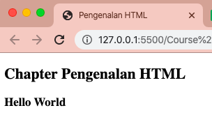

# Hello Word dalam HTML

Setelah kita mengetahui apa itu HTML, fungsi, dan aturan penulisannya.
Jika kita mempelajari sebuah bahasa baru dalam *programming*, pastinya paling awal kita akan membuat contoh simple penggunaan nya.

Sebelum memulai, kita perlu memiliki sebuah Text Editor nih.
Text Editor adalah aplikasi untuk membuat atau mengedit sebuah file text, banyak macam nya seperti *adobe dreamweaver* , *atom* , *visual studio code*, *notepad++*. Nantinya dalam course ini akan memakai text editor Visual Studio Code, ya.

## Membuat Hello Word dengan HTML

Langkah 1. Buat File `.html`

Setelah kita membuat file dengan type `.html`, selanjutnya kita isi dengan sintaks di bawah ini:

```html
<!DOCTYPE html>
<html>

<head>
    <meta charset="UTF-8">
    <title>Pengenalan HTML</title>
</head>

<body>
    <h2>Chapter Pengenalan HTML</h2>
    <h3>Hello World</h3>
</body>

</html>
```

Langkah 2. Jalankan di browser

Jika sudah selesai menuliskan sintaksnya, save. Lalu jalankan di browser, hasilnya akan seperti ini:


