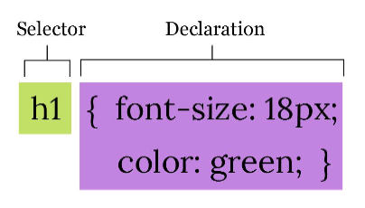
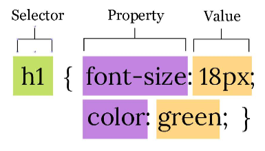

# Aturan Dasar Penulisan CSS

1. Pengertian **Selector, Declaration, Property** dan **Value CSS**

   - **Selector** digunakan untuk mencari bagian mana dari HTML yang ingin di-style. CSS menyediakan beragam jenis selector, mulai dari yang sederhana seperti element selector, hingga yang cukup rumit seperti pseudo selector.
   - **Declaration** adalah kumpulan aturan style CSS yang berada di antara tanda kurung kurawal. Di dalam declaration, terdapat pasangan _property_ dan value.

     

   - **Property** adalah jenis style, atau bagian apa yang akan diubah dari sebuah tag HTML. Misalnya jenis font, ukuran huruf, warna background, dll. Terdapat ratusan _property_ di dalam CSS dan terus bertambah (terutama untuk _property CSS3_). Agar bisa digunakan, sebuah property memiliki nilai satuan atau value.

   - **Value** ini sangat bergantung kepada jenis property, misalnya untuk ukuran font bisa menggunakan satuan pixel, point, dll. Tapi untuk property warna (color) kita harus menggunakan value berupa nama warna atau kode RGB.

     

## Cara Penulisan Selector, Property dan Value

Seperti yang telah kita lihat sebelumnya, penulisan kode **CSS** cukup sederhana:

- Sebuah style di dalam **CSS** diawali dengan penulisan selector, yakni bagian apa dari HTML yang ingin diubah tampilannya.
- Setelah penulisan selector, seluruh property dan value (declaration) untuk selector tersebut harus berada di dalam tanda kurung kurawal.
- Penulisan property dengan value dipisah oleh tanda titik dua “ : ”.
- Antara satu property dengan property lain dipisah dengan tanda titik koma “ ; ”.
- Khusus untuk penulisan property terakhir, tanda titik koma “ ; ” boleh tidak ditulis, tapi sangat disarankan untuk tetap menambahkannya.

## Case Sensitivity

**Case Sensitivity** adalah istilah yang membahas apakah sebuah bahasa pemrograman membe- dakan penulisan huruf kecil dan huruf besar.

Secara umum, **CSS** bersifat case-insensitive, yang berarti tidak membedakan huruf besar dan huruf kecil. Kedua kode berikut akan dianggap sama:

```css
p {
  font-size: 18px;
}
p {
  font-size: 18px;
}
```

Keduanya digunakan untuk mengubah ukuran font paragraf (`tag <p>`) menjadi 18 pixel.
