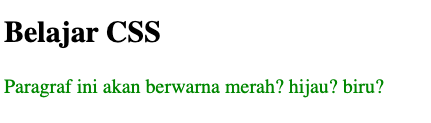
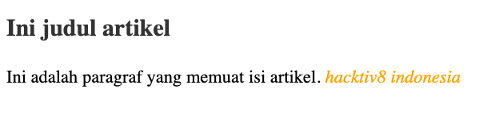
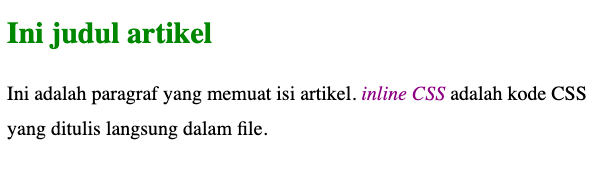

# Input Sintaks CSS

Ada 3 cara untuk memasukkan kode CSS kedalam HTML, yakni:

1. Inline style CSS
2. Embedded atau internal style CSS
3. External style CSS.

Selain ke tiga metode ini sebenarnya terdapat 2 jenis style lain yang perlu kita bahas terkait cascade, yakni web browser style dan user style.

1. Inline Style CSS

   Konsep **Cascading** dari CSS memiliki aturan mengenai style mana yang layak diprioritaskan. Secara umum berikut adalah urutan prioritas style pada CSS (dimulai dari yang paling kuat):

   - User style
   - Inline Syle
   - Embedded style dan External Style
   - Web browser style

   Selain urutan ini, untuk jenis selector yang sama pada satu jenis style, style yang paling terakhirlah yang akan menang, atau istilahnya: **“Last rules apply”**.

   sebagai contoh berikut :

   ```html
   <!DOCTYPE html>
   <html lang="en">
     <head>
       <meta charset="UTF-8" />
       <meta name="viewport" content="width=device-width, initial-scale=1.0" />
       <meta http-equiv="X-UA-Compatible" content="ie=edge" />
       <title>Latihan CSS</title>
       <style>
         p {
           color: blue;
         }

         p {
           color: red;
         }
       </style>
     </head>

     <body>
       <h2>Belajar CSS</h2>
       <p style="color:green">
         Paragraf ini akan berwarna merah? hijau? biru?
       </p>
     </body>
   </html>
   ```

   

   Kali ini paragraf akan berwarna hijau. Ini terjadi sesuai dengan urutan prioritas **“cascading”**, dimana _inline style_ memiliki tingkat prioritas lebih tinggi dibandingkan _embedded/internal style_ (perhatikan kembali daftar urutan prioritas kita sebelumnya).

2. Embedded/internal style CSS

   _Internal CSS_ adalah kode CSS yang ditulis di dalam tag `<style>`. _Internal CSS_ juga dikenal dengan sebutan _Embeded CSS_.

   Tag `<style>` biasanya ditulis di dalam tag `<head>`. Bisa juga ditulis di dalam `<body>`, namun lebih banyak ditulis di dalam `<head>`.

   ```html
   <!DOCTYPE html>
   <html>
     <head>
       <title>Contoh Internal CSS</title>
       <!-- penulisan internal css dalam tag head -->
       <style type="text/css">
         p {
           font-family: serif;
           line-height: 1.75em;
           font-size: 18px;
         }

         i {
           font-family: sans;
           color: orange;
         }
       </style>
     </head>
     <body>
       <!-- penulisan internal css dalam tag body -->
       <style type="text/css">
         h2 {
           font-family: sans;
           color: #333;
         }
       </style>
       <h2>Ini judul artikel</h2>
       <p>
         Ini adalah paragraf yang memuat isi artikel.
         <i>hacktiv8 indonesia</i>
       </p>
     </body>
   </html>
   ```

   

3. Eksternal CSS

   Eksternal CSS adalah kode CSS yang ditulis terpisah dengan kode HTML. Eksternal CSS ditulis disebuah file khusus yang berekstensi .css.

   Sebagai contoh, saya akan membuat sebuah file bernama style.css.

   Berikut ini cuplikan isi file **style.css**

   ```css
   p {
     font-family: serif;
     line-height: 1.75em;
   }

   i {
     font-family: sans;
     color: purple;
   }

   h2 {
     font-family: sans;
     color: green;
   }
   ```

   Untuk menggunakan CSS tersebut dalam HTML, kita perlu mengimpornya. Ada beberapa cara memasukkan kode CSS dari berkas eksternal:

   Pertama menggunakan tag `<link>`

   ```html
   <link rel="stylesheet" type="text/css" href="style.css">
   ```

   Penulisan pada HTML versi lengkapnya seperti ini:

   ```html
   <!DOCTYPE html>
   <html>
     <head>
       <title>Contoh Eksternal CSS</title>
       <link rel="stylesheet" type="text/css" href="style.css" />
     </head>

     <body>
       <h2>Ini judul artikel</h2>
       <p>
         Ini adalah paragraf yang memuat isi artikel.
         <i>inline CSS</i> adalah kode CSS yang ditulis langsung dalam file.
       </p>
     </body>
   </html>
   ```

   
