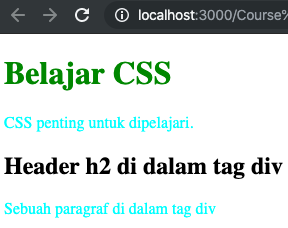

# CSS Selector

Memahami cara penggunaan _selector_ merupakan salah satu aset terpenting dalam menguasai CSS. Mengetahui kapan sebuah _selector_ digunakan akan membantu proses desain web menjadi lebih efektif dan efisien.

Pada dasarnya _selector_ adalah sebuah pola (pattern) yang digunakan untuk mencari suatu tag/element di dalam _HTML_. Misalnya, kita ingin mencari semua `tag <p>` di dalam halaman _HTML_, mencari seluruh `tag <h1>` yang memiliki atribut `class="judul"` atau mencari seluruh paragraf di dalam `tag <div>` yang memiliki `id="header"`.

_Selector_ di dalam _CSS_ sangat beragam, mulai dari _selector_ dasar seperti **element selector**, **class selector** atau **ID selector**, hingga selector yang sangat spesifik seperti **pseudo class selector** atau **pseudo element selector**.

1. **Universal Selector**

   _Selector_ ini adalah yang paling sederhana sekaligus paling **‘powerful’**. Universal _selector_ ditulis menggunakan karakter bintang: **‘ \* ‘**.

   Perhatikan contoh kode CSS berikut:

   ```css
   * {
     color: pink;
     background-color: hotpink;
   }
   ```

   Kode diatas berarti ubah warna teks menjadi **Pink** dan warna background menjadi **hotpink** untuk seluruh tag HTML. Kata-kata yang paling penting disini adalah **“seluruh tag HTML”**.

   Efek dari **universal selector** sangat kuat, oleh karena itu _selector_ ini jarang digunakan karena kita tidak bisa mengontrol tag-tag apa saja yang akan di-_style_ oleh _selector_ ini.

2. **Element Selector**

   _Element selector_ atau disebut juga dengan **tag selector** atau **type selector** adalah **selector CSS** yang digunakan untuk mencari **semua tag HTML**. Penulisannya juga sama dengan tag _HTML_ biasa, tapi tanpa tanda kurung siku.

   Sebagai contoh, perhatikan kode CSS berikut:

   ```html
   <!DOCTYPE html>
   <html lang="en">
    <head>
    <meta charset="UTF-8">
    <meta name="viewport" content="width=device-width, initial-scale=1.0">
    <meta http-equiv="X-UA-Compatible" content="ie=edge">
    <title>Element Selector</title>
    <style>
        h1 {
            color: green;
        }

        p {
            color: aqua;
        }
    </style>
   </head>
   <body>
        <h1>Belajar CSS</h1>
        <p>CSS penting untuk dipelajari.</p>
    <div>
        <h2>Header h2 di dalam tag div</h2>
        <p>Sebuah paragraf di dalam tag div</p>
    </div>
   </body>
   </html>
   ```

   

   Dalam contoh diatas, saya membuat 2 buah _selector_, yakni **h1** dan **p**. Keduanya digunakan untuk mencari seluruh kode _HTML_ dengan _tag_ `<h1>` dan `<p>` kemudian mengubah warna teks _tag_ tersebut.

   **Element selector** cukup sering digunakan. Namun karena sifatnya yang global (mengubah seluruh tag _HTML_), kita perlu menggunakan **class selector** atau **id selector** jika ingin mencari kode _HTML_ yang lebih spesifik.

3. **Class Selector**

   _Class Selector_ mungkin menjadi selector yang paling sering digunakan di dalam CSS. Selector ini akan mencari setiap tag _HTML_ yang memiliki atribut class dengan nama yang sama. Untuk menulis _class selector_, diawali dengan tanda titik **"."**

   Sebagai contoh, agar sebuah paragraf bisa diakses dengan class selector, saya harus menambahkan atribut class pada tag `<p>`, seperti contoh berikut:

   ```html
   <p class="hacktiv8">Hacktiv 8 Indonesia</p>
   ```

   Nama dari atribut class ini bisa diubah sesuka hati, tergantung apa yang dibutuhkan. Dalam
   contoh diatas saya menggunakan: “sukses”.
   Untuk mengakses paragraf tersebut, bisa menggunakan kode berikut:

   ```css
   .hacktiv8 {
     color: orange;
   }
   ```

   Perhatikan penambahan tanda titik pada kata “.sukses”, inilah yang menandakan bahwa saya ingin mencari sebuah (atau beberapa) tag HTML yang memiliki atribut class bernilai sukses.

   Berbeda dengan **id selector** yang akan kita pelajari setelah ini, _class selector_ bisa digunakan oleh lebih dari 1 _tag HTML_.

4. **ID Selector**

   Cara penggunaan **ID selector** hampir mirip dengan _class selector_. Jika pada _class selector_ kita menggunakan atribut _class_ untuk menandai _tag HTML_, untuk **ID selector** kita menggunakan atribut _id_, seperti contoh berikut:

   ```html
   <p id="pesan">Proses registrasi berhasil</p>
   ```

   Untuk mengakses paragraf tersebut, penulisan selector CSS harus diawali dengan tanda pagar: **“ # ”**. Jika saya ingin paragraf diatas berwarna hijau, berikut kode CSSnya:

   ```css
   #pesan {
     color: green;
   }
   ```

   Perbedaan paling mendasar antara id selector dengan class selector adalah: id selector hanya bisa digunakan 1 kali di dalam setiap halaman HTML, atau dengan kata lain, setiap id harus unik dan tidak boleh ada 2 buah tag dengan id yang sama.

   Dalam contoh diatas saya menggunakan id="pesan" pada tag `<p>`, oleh sebab itu tidak boleh ada tag HTML lain yang juga menggunakan atribut `id="pesan"`.

   Pada prakteknya, kita lebih sering menggunakan _class selector_ daripada id selector. ID selector memiliki urutan prioritas yang sangat tinggi, dan bisa menimpa style lain, termasuk _class selector_.

   Biasanya atribut _id_ lebih banyak digunakan oleh bahasa pemrograman _JavaScript_.
