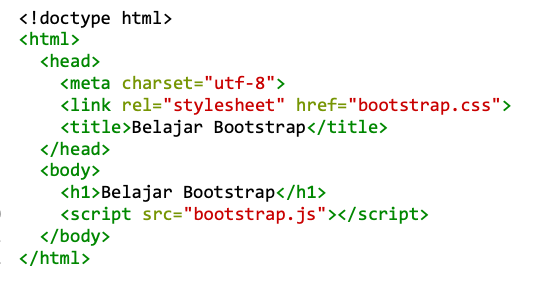
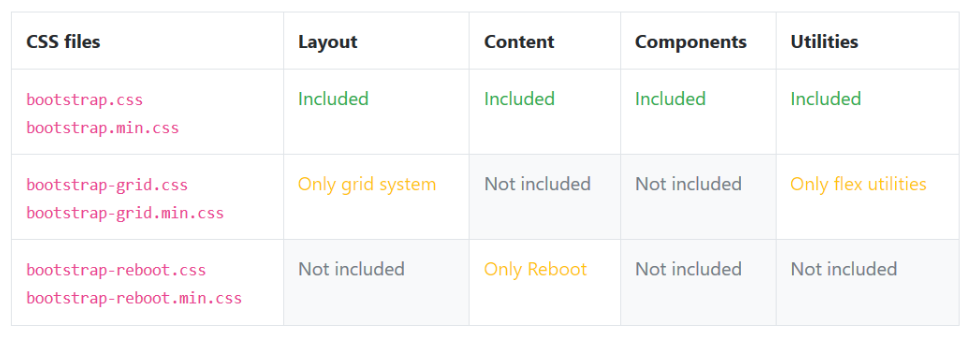
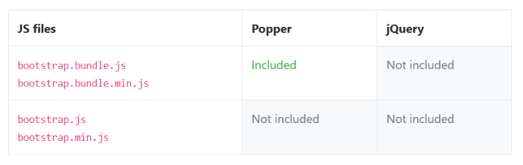
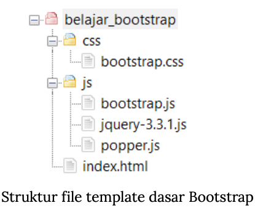

# Download File Bootstrap

Website resmi Bootstrap di getbootstrap.com menyediakan 2 jenis "paket" file Bootstrap.

Paket pertama adalah **versi lengkap yang berisi semua file source code Bootstrap yang disimpan sebagai format SaSS** `.scss`, dokumentasi Bootstrap dalam format markdown, file package.json untuk npm module, serta berbagai file lain. Bootstrap menyebut paket ini sebagai "Source files".

**Paket "Source files" lebih ditujukan untuk pengguna advaced yang ingin mengutak-atik "daleman" Bootstrap** menggunakan SaSS (CSS preprocessor).

Paket kedua adalah versi praktis yang **berisi file JavaScript dan CSS Bootstrap siap pakai, yakni berisi file bootstrap.css dan bootstrap.js**. Bootstrap menyebut paket ini sebagai "Compiled CSS and JS".

## Mengenal File Bootstrap

File Bootstrap 4 hanya terdiri dari 2 buah file: **bootstrap.css dan bootstrap.js**.

File **boostrap.css berisi kode CSS dalam bentuk selector dan property** (sebagaimana kode CSS pada umumnya). Sedangkan **file bootstrap.js berisi kode JavaScript untuk membuat berbagai efek interaktif komponen Bootstrap.**

Proses import file boostrap.css berada di baris 5, yakni di dalam tag `<head>`. Sedangkan file bootstrap.js ditempatkan di akhir tag `<body>` yakni di baris 10.

**Penempatan file JavaScript di akhir ini supaya tidak terjadi Render-Blocking JavaScript**, yakni sebuah situasi dimana proses menampilkan website terhenti sejenak karena harus menunggu download file JavaScript external.

Dengan menempatkan posisi pemanggilan file JavaScript external di akhir tag `<body>`, web browser akan memproses kode HTML di atasnya terlebih dahulu, sehingga web akan tampil sebelum proses download file JavaScript external dilakukan.

## Folder CSS Bootstrap

## Folder JS Bootstrap

Terdapat 8 file di dalam folder js, namun 4 di antaranya memiliki extension `.map` yang merupakan file "source maps" untuk keperluan debugging.

## File jQuery dan Pooper.js

> Download file jQuery dari web resmi jQuery: jquery.com.
>
> Download file Pooper web resmi Popper.js di popper.js.org.

## Template dasar Bootstrap

