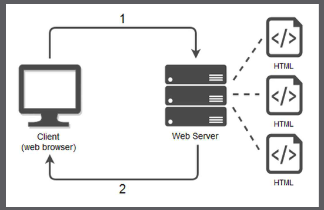
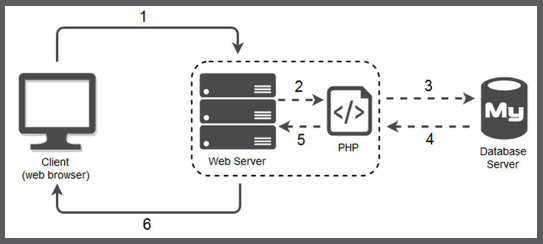

# Berkenalan Dengan PHP

## Apa Itu PHP

“PHP adalah bahasa pemrograman web yang digunakan untuk men-generate atau menghasilkan kode HTML.”

PHP adalah bahasa pemrograman yang digunakan untuk **membuat halaman Web dinamis dan interaktif**. Selain itu PHP juga merupakan bahasa pemrograman yang bersifat open source yang banyak digunakan dan gratis untuk diunduh.

Untuk pembuatan web, **kode PHP biasanya di sisipkan kedalam dokumen HTML**. Oleh karena itu PHP disebut juga sebagai Scripting Language atau bahasa pemrograman script.

### Contoh

## Kode Program dengan HTML

```html
<!DOCTYPE html>
<html lang="en">

<head>
    <meta charset="UTF-8">
    <meta name="viewport" content="width=device-width, initial-scale=1.0">
    <title>Document</title>
</head>

<body>
    <h2>Daftar Absensi Mahasiswa</h2>
    <ol>
        <li>Nama Mahasiswa 1</li>
        <li>Nama Mahasiswa 2</li>
        <li>Nama Mahasiswa 3</li>
        <li>Nama Mahasiswa 4</li>
        <li>Nama Mahasiswa 5</li>
        <li>Nama Mahasiswa 6</li>
        <li>Nama Mahasiswa 7</li>
        <li>Nama Mahasiswa 8</li>
        <li>Nama Mahasiswa 9</li>
        <li>Nama Mahasiswa 10</li>
    </ol>
</body>

</html>
```

## Kode Program dengan PHP

```html
<!DOCTYPE html>
<html lang="en">

<head>
    <meta charset="UTF-8">
    <meta name="viewport" content="width=device-width, initial-scale=1.0">
    <title>Document</title>
</head>

<body>
    <h2>Daftar Absensi Mahasiswa</h2>
    <ol>
        <?php
            for ($i= 1; $i <= 10; $i++) {
            echo "<li>Nama Mahasiswa ke-$i</li>";
            }
        ?>
    </ol>
</body>
</html>
```

> “Bagaimana jika ingin menampilkan 1000 nama mahasiswa? Menggunakan kode HTML “murni”
>
> Kita terpaksa men-copy-paste baris `<li>` Nama Mahasiswa ke-1`</li>` sebanyak 1.000 kali, kemudian mengganti satu-satu urutan angka yang ada.
>
> Dengan bantuan PHP, hal ini sangat mudah dilakukan cukup dengan menambahkan dua angka 0 pada baris ke 11 (dari 10 menjadi 1000), hasilnya adalah 1.000 nama

## PHP Sebagai Server Side Programming Language

### Client-side Programming Language

Client side programming language (bahasa pemrograman berbasis client) adalah **jenis bahasa pemrograman yang berjalan dan di proses di sisi client**. Ketika berbicara tentang pemrograman web, client mengacu kepada pengunjung website, atau lebih spesifik lagi kepada web browser yang digunakan pengunjung ketika mengakses sebuah website.

HTML dan CSS merupakan contoh dari **bahasa pemrograman client side** (walaupun menyebut keduanya sebagai ‘bahasa pemrograman’ sebenarnya kurang tepat). Ketika kita membuka website yang berisi kode HTML dan CSS, kode tersebut diproses di komputer pengunjung (oleh web browser-nya).

JavaScript adalah contoh lain dari bahasa pemrograman client side. Seluruh kode JavaScript yang terdapat pada sebuah website, diproses di dalam web browser pengunjung, yakni disisi client.

### Server-Side Programming Language

Server side programming language (bahasa pemrograman berbasis server) adalah **kelompok bahasa pemrograman yang prosesnya di lakukan di dalam server, bukan di komputer pengunjung.**

Karena termasuk bahasa pemrograman berbasis server, kita harus menjalankan kode-kode PHP dari sebuah server.

Dengan kata lain, kode PHP tidak bisa dijalankan tanpa server.

Server tersedia dalam berbagai fungsi, tergantung layanan yang disediakan. Beberapa contohnya adalah:

1. **File Server**: Menyimpan dan berbagi pakai file (sharing).
2. **Database Server**: Menyimpan dan menampilkan data.
3. **Email Server**: Menyimpan dan mengatur lalu lintas email.
4. **Web Server**: Memproses dan menangani permintaan halaman web.

## Cara Kerja PHP dan Web Server

### Cara HTML diproses oleh Web Server



### Cara PHP diproses oleh Web Server


