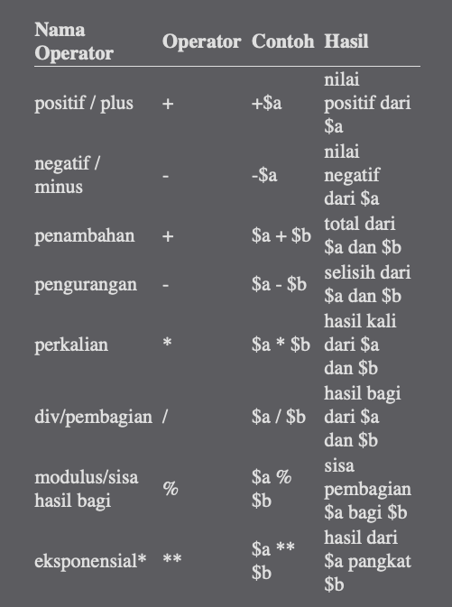
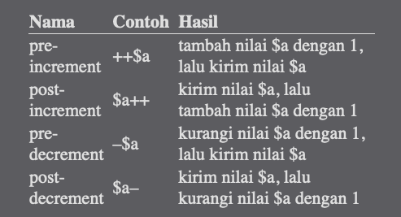
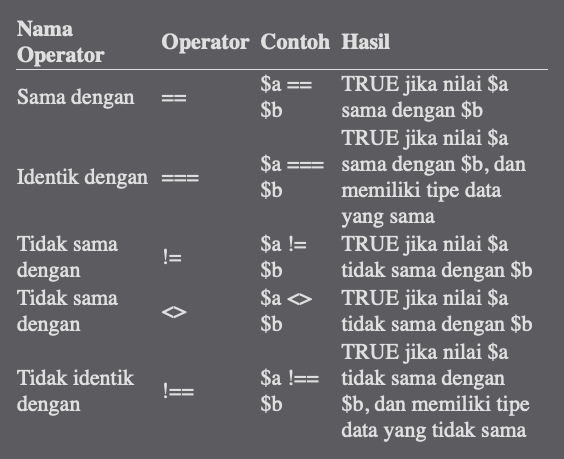
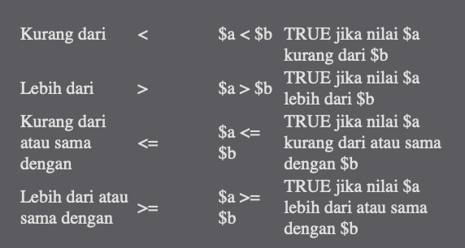
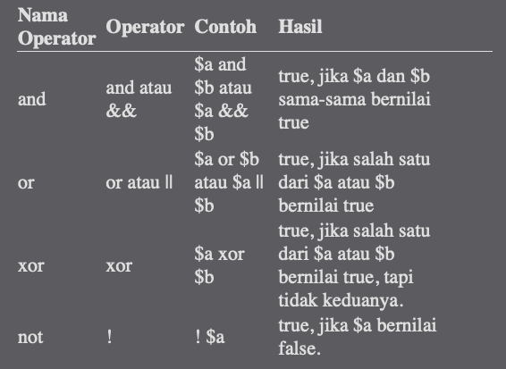
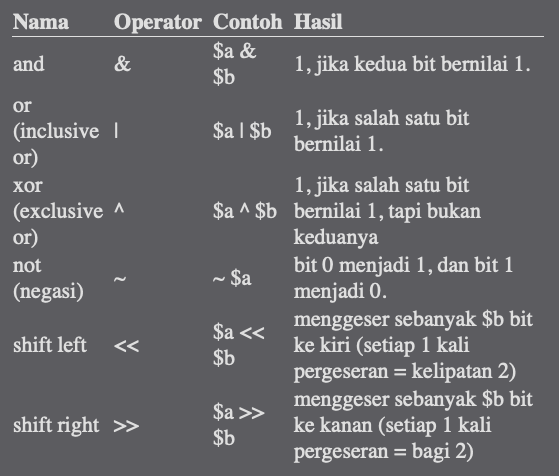

# Operator pada PHP

Operator adalah sesuatu yang menghasilkan nilai dari satu atau lebih data. Sebagai contoh, tanda tambah ( + ) adalah operator aritmatika yang menghasilkan nilai dari penambahan dua buah angka.

## Jenis - Jenis Operator pada PHP

1. **Operator Aritmatika**
2. **Operator Increment dan Decrement**
3. **Operator Perbandingan**
4. **Operator Logika**
5. **Operator String**
6. **Operator Bitwise**

### Operator Aritmatika

**Operator Aritmatika** adalah **operator matematis yang kita gunakan sehari-hari**. PHP mengenal 8 operator aritmatika, yakni penambahan, pengurangan, perkalian, pembagian, modulus, plus, minus dan eksponensial.

> ** Khusus untuk Eksponensial baru ditambahkan pada PHP 5.6

<!-- Contoh ada di file aritmatika.php -->

**Operator aritmatika juga memiliki aturan prioritas.** **Operasi perkalian dan pembagian memiliki prioritas lebih tinggi daripada penambahan dan pengurangan.**

Untuk mengubah urutan ini, kita bisa menggunakan tanda kurung. Contoh ada di file 02.artimatika_tanda_kurung.php

### Operator Increment dan Decrement

Operator increment dan decrement adalah **penyebutan untuk operasi seperti $a++ atau $a--**. Kedua operator ini sering digunakan dalam perulangan (looping).

**Operator increment digunakan untuk menambah variabel sebanyak 1 angka**. Penulisannya menggunakan tanda tambah 2 kali baik diawal maupun diakhir variabel, seperti contoh berikut: `$a++` atau `++$a`. Operasi `$a++` dapat disamakan dengan penulisan singkat dari `$a = $a + 1`.

**Operator decrement digunakan untuk mengurangi variabel sebanyak 1 angka.** Penulisannya menggunakan tanda kurang 2 kali baik diawal maupun diakhir variabel, seperti contoh berikut: `$a--` atau `--$a`. Operasi `$a--` dapat disamakan dengan penulisan singkat dari `$a = $a - 1`.

ada di dalam file increment.php

### Operator Perbandingan

**Operator perbandingan digunakan untuk membandingkan 2 buah operand atau lebih.** Hasil dari operator ini berupa nilai **boolean true atau false.**

Sebagai contoh, operasi `5 > 3` akan menghasilkan nilai **true**, karena **5 lebih besar dari 3**. Sedangkan operasi `1 > 2` akan menghasilkan nilai **false**, karena **1 tidak lebih besar dari 2**.

file perbandingan.php

Operasi perbandingan tidak hanya bisa dilakukan untuk tipe data angka saja (integer dan float), namun juga bisa untuk tipe data lain, seperti string, array, bahkan object.

file perbandingan string.php

Perbedaan antara operator `==` dengan `===` juga perlu dibahas. **Operator ‘sama dengan’ `(==)` akan membandingkan 2 nilai tanpa memperhatikan tipe datanya**, sehingga ‘aku’ `== 0` adalah true. Jika kita ingin proses perbandingan juga **memperhatikan tipe data yang sama, maka gunakan operator ‘identik dengan’ `(===)`**. Operator ini akan menghasilkan true jika nilai data sama dan tipe data yang dibandingkan juga sama.

**Operator perbandingan sering digunakan untuk membuat percabangan program, seperti logika IF atau switch.**

### Operator Logika

Operator logika adalah **operator yang digunakan untuk membandingkan 2 kondisi logika, yaitu logika benar (true) dan logika salah (false).** Nilai yang dibandingkan **harus bertipe boolean**. Jika tidak, PHP akan menkonversinya secara otomatis.

> Penulisan operator logika adalah case insensitif, artinya tidak memperhatikan huruf besar atau kecil. Baik ‘and’, ‘AND’, atau ‘aNd’ dianggap sah oleh PHP.
>
> Operator ‘and’ dan ’&&’ sama-sama berarti logika ‘and’, namun operator ‘&&’ memiliki urutan prioritas yang lebih tinggi. Sebagai contoh, operasi $hasil = $a and $b && $c akan diproses sebagai $hasil = $a and ($b && $c). Begitu juga dengan operator ‘or’ dan ‘||’, dimana ‘||’ memiliki prioritas lebih tinggi daripada ‘or’.

<!-- file logika.php-->

## Operator String

Dalam PHP, hanya terdapat 1 jenis operator string, yakni operasi penyambungan string (string concatenation). Operator ini menggunakan karakter titik ( . ). Jika operand bukan string, akan dikonversi menjadi string secara otomatis.

<!-- file string1.php-->

Operator ‘titik’ ini juga bisa digunakan untuk menggabungkan variabel dengan string di dalam perintah echo.

<!-- file string2.php-->

Penulisan seperti ini sangat sering digunakan. Selain dengan operator titik ( . ), kita juga bisa **menggabungkan 2 variabel string dengan menggunakan double quote (")**.

Ketika membuat string menggunakan double quote (tanda kutip dua), **setiap variabel akan diproses menjadi nilainya. Hal ini bisa dimanfaatkan untuk penggabungan string.**

<!-- file string2.php-->

## Operetor Bitwise

Operator bitwise adalah **operator khusus untuk menangani operasi logika bilangan biner.**

**Bilangan biner atau binary adalah jenis bilangan yang hanya terdiri dari 2 jenis angka, yakni 0 dan 1.** Operator bitwise tidak terlalu sering digunakan, kecuali jika anda membuat program yang langsung berkaitan dengan pemrosesan bilangan biner (biasanya untuk pemrosesan bit-bit karakter).

>Operator ini sangat jarang digunakan dalam PHP
